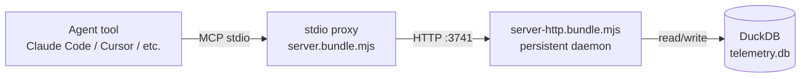

# Architecture Overview

> Living document. Reflects current system state. Updated after every pipeline run.
> Do not archive this file — update it in place.

Last updated: 0000011-defects-and-query-telemetry-fix

---

## System Summary

`structured-telemetry-mcp` is a local MCP server that ingests structured telemetry events (phase timings, failures, context pressure, loop iterations, phase reversals) from Planifest pipeline agents and answers structured queries over them. It runs continuously as a background service — on Windows via `nssm`, and as of 0000010 also on macOS (`launchd`) and Linux (`systemd --user`) — so any Planifest project's telemetry hooks work without a foreground terminal.

---

## Components

| Component | Type | Purpose | Status |
|-----------|------|---------|--------|
| structured-telemetry-mcp | microservice | MCP server + local HTTP backend for telemetry ingestion, querying, and service supervision | active |

---

## Communication Patterns

The stdio proxy (spawned per agent session, per ADR-009) forwards `emit_event`/`query_telemetry` calls over HTTP to a single persistent backend process, which owns the one DuckDB connection. The backend is what 0000010's service scripts install and supervise — it's the process launchd/systemd/nssm keep running.

---

## Data Ownership

| Data Store | Owner | Consumers |
|------------|-------|-----------|
| `telemetry.db` (DuckDB, `~/.planifest/telemetry.db`) | structured-telemetry-mcp | Read-only via `query_telemetry` MCP tool or `POST /query` REST endpoint — never direct file access |

---

## External Dependencies

| Dependency | Type | Components That Use It |
|-----------|------|----------------------|
| `@modelcontextprotocol/sdk` | npm | structured-telemetry-mcp (MCP tool registration, stdio transport) |
| `@duckdb/node-api` | npm | structured-telemetry-mcp (storage engine, ADR-002) |
| `ajv` / `ajv-formats` | npm | structured-telemetry-mcp (JSON Schema wire validation, ADR-005) |
| `zod` | npm | structured-telemetry-mcp (`emit_event` tool-argument gate only, ADR-013 — not a replacement for ajv) |
| `planifest-framework` (sibling repo) | consumer, not a code dependency | Calls `emit_event`/`query_telemetry`; as of 0000010 also emits `loop_iteration` and `phase_reversal_*` events |
| macOS `launchd` / Linux `systemd --user` / Windows `nssm` | OS service supervisor | Keeps the backend process running across logout/reboot (0000010, 0000008-foundation for Windows) |

---

## Key Architectural Decisions

Reference `docs/decisions-index.md` for the full list.

- **ADR-001–002:** TypeScript/Node.js + DuckDB foundation.
- **ADR-005:** JSON Schema/ajv is the source of truth for event wire validation — deliberately not Zod, so the schema stays shareable with `planifest-framework` without a TS dependency.
- **ADR-009:** stdio proxy + persistent HTTP backend — the architecture 0000010's service scripts supervise.
- **ADR-013:** `emit_event`'s MCP tool *argument* now uses a real Zod object schema (distinct from ADR-005's wire-schema decision) — gives calling models a structural scaffold instead of an opaque `z.unknown()`.
- **ADR-014:** Background service supervision is always user-scoped (never a root daemon), and never silently escalates privileges or changes persistent account settings — explains and prints the remediation command instead.
- **ADR-015:** `query_telemetry` gets the same tool-argument treatment as ADR-013, but permissively (`.passthrough()`, no enum, no rename) — `dispatchQuery`'s existing validation remains the semantic source of truth for query shape.

---

*Template: architecture-overview.template.md*
