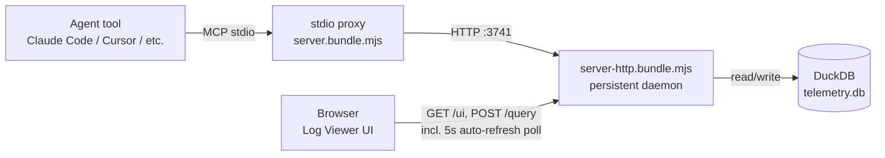

# Architecture Overview

> Living document. Reflects current system state. Updated after every pipeline run.
> Do not archive this file — update it in place.

Last updated: 0000017-log-viewer-enhancements

---

## System Summary

`structured-telemetry-mcp` is a local MCP server that ingests structured telemetry events (phase timings, failures, context pressure, loop iterations, phase reversals) from Planifest pipeline agents and answers structured queries over them. It runs continuously as a background service — on Windows via `nssm`, and as of 0000010 also on macOS (`launchd`) and Linux (`systemd --user`) — so any Planifest project's telemetry hooks work without a foreground terminal. As of 0000015, the same backend also serves a read-only browser UI (`GET /ui`) for browsing, filtering, and paging events — the first human-facing (non-MCP, non-CLI) surface this component exposes. As of 0000016, the HTTP/browser surface (`/emit`, `/query`, `/health`, `/ui`) has true black-box E2E coverage (`@playwright/test`, real server process + ephemeral DuckDB per run) — the first automated test layer in this project that exercises the live `node:http` server rather than its exported handlers. As of 0000017, the Log Viewer gained three interaction-quality improvements over 0000015's static browse-only view: live auto-refresh/tail mode (interval polling, no push mechanism), per-field filter-value suggestions (a new `distinct_values` query mode), and sortable table headers backed by a genuine per-column backend sort (previously hardcoded to `timestamp` only) — all three kept in sync via URL query params.

---

## Components

| Component | Type | Purpose | Status |
|-----------|------|---------|--------|
| structured-telemetry-mcp | microservice | MCP server + local HTTP backend for telemetry ingestion, querying, and service supervision | active |

---

## Communication Patterns

The stdio proxy (spawned per agent session, per ADR-009) forwards `emit_event`/`query_telemetry` calls over HTTP to a single persistent backend process, which owns the one DuckDB connection. The backend is what 0000010's service scripts install and supervise — it's the process launchd/systemd/nssm keep running. As of 0000015, a human's browser talks to the same backend directly (`GET /ui` for the page, same-origin `POST /query` for data) — no proxy, no separate process (ADR-018).

---

## Data Ownership

| Data Store | Owner | Consumers |
|------------|-------|-----------|
| `telemetry.db` (DuckDB, `~/.planifest/telemetry.db`) | structured-telemetry-mcp | Read-only via `query_telemetry` MCP tool or `POST /query` REST endpoint — never direct file access |

---

## External Dependencies

| Dependency | Type | Components That Use It |
|-----------|------|----------------------|
| `@modelcontextprotocol/sdk` | npm | structured-telemetry-mcp (MCP tool registration, stdio transport) |
| `@duckdb/node-api` | npm | structured-telemetry-mcp (storage engine, ADR-002) |
| `ajv` / `ajv-formats` | npm | structured-telemetry-mcp (JSON Schema wire validation, ADR-005) |
| `zod` | npm | structured-telemetry-mcp (`emit_event` tool-argument gate only, ADR-013 — not a replacement for ajv) |
| `planifest-framework` (sibling repo) | consumer, not a code dependency | Calls `emit_event`/`query_telemetry`; as of 0000010 also emits `loop_iteration` and `phase_reversal_*` events |
| macOS `launchd` / Linux `systemd --user` / Windows `nssm` | OS service supervisor | Keeps the backend process running across logout/reboot (0000010, 0000008-foundation for Windows) |

---

## Key Architectural Decisions

Reference `docs/decisions-index.md` for the full list.

- **ADR-001–002:** TypeScript/Node.js + DuckDB foundation.
- **ADR-005:** JSON Schema/ajv is the source of truth for event wire validation — deliberately not Zod, so the schema stays shareable with `planifest-framework` without a TS dependency.
- **ADR-009:** stdio proxy + persistent HTTP backend — the architecture 0000010's service scripts supervise.
- **ADR-013:** `emit_event`'s MCP tool *argument* now uses a real Zod object schema (distinct from ADR-005's wire-schema decision) — gives calling models a structural scaffold instead of an opaque `z.unknown()`.
- **ADR-014:** Background service supervision is always user-scoped (never a root daemon), and never silently escalates privileges or changes persistent account settings — explains and prints the remediation command instead.
- **ADR-015:** `query_telemetry` gets the same tool-argument treatment as ADR-013, but permissively (`.passthrough()`, no enum, no rename) — `dispatchQuery`'s existing validation remains the semantic source of truth for query shape.
- **ADR-016:** `event_log`'s mandatory scope-filter requirement is removed (amends ADR-010) — every request is bounded solely by `limit`/`offset` instead.
- **ADR-017:** `product_id` is additive (optional envelope field + nullable column) and never backfilled on existing rows — no reliable signal exists for pre-0000015 data.
- **ADR-018:** The Log Viewer UI is plain HTML/CSS/vanilla JS with no build step, embedded as a TypeScript string and served in-process — no new component, no new dependency.
- **ADR-019:** Populating `product_id` in `planifest-framework`'s own emission hooks is that product's responsibility, not this one's — tracked as a cross-product backlog dependency, not built here.
- **ADR-020:** `@playwright/test` adopted as the E2E test framework for both suites (backend HTTP, browser UI) — Vitest continues to own all unit/integration tests unchanged.
- **ADR-021:** The Playwright MCP server is an interactive test-authoring/verification aid used during codegen only — `@playwright/test` remains the sole CI-executed engine for the shipped suites.
- **ADR-022:** Both E2E suites use an ephemeral real-server-process + temp-DuckDB harness per run (never handler-level mocking, never a shared dev instance) — genuine black-box coverage, isolated by construction.
- **ADR-023:** The UI E2E suite is Chromium-only — the vanilla-JS, framework-free `/ui` page (ADR-018) carries low cross-browser risk, and the narrower scope keeps CI runtime well within budget.
- **ADR-024:** One shared, exported column allow-list (`src/query/column-allow-list.ts`) is the single SQL-injection-via-identifier defense for both `event_log`'s `sortField` and `distinct_values`' `field` — DuckDB has no parameterized-identifier binding, so this allow-list is the only defense for either.
- **ADR-025:** `event_log` gains a real per-column `sortField` (allow-listed, defaults to `timestamp`), replacing the previously hardcoded `ORDER BY timestamp` — additive, non-breaking.
- **ADR-026:** `distinct_values` is a new `mode` on the existing `POST /query` dispatch, not a new REST route — consistent with how every other query family (bottlenecks, failures, token-efficiency, event_log) is reached.
- **ADR-027:** Auto-refresh is client-side interval polling (5s) against the existing `/query` endpoint — no WebSocket/SSE/push mechanism; the server has no awareness a request is a "poll."

---

*Template: architecture-overview.template.md*
