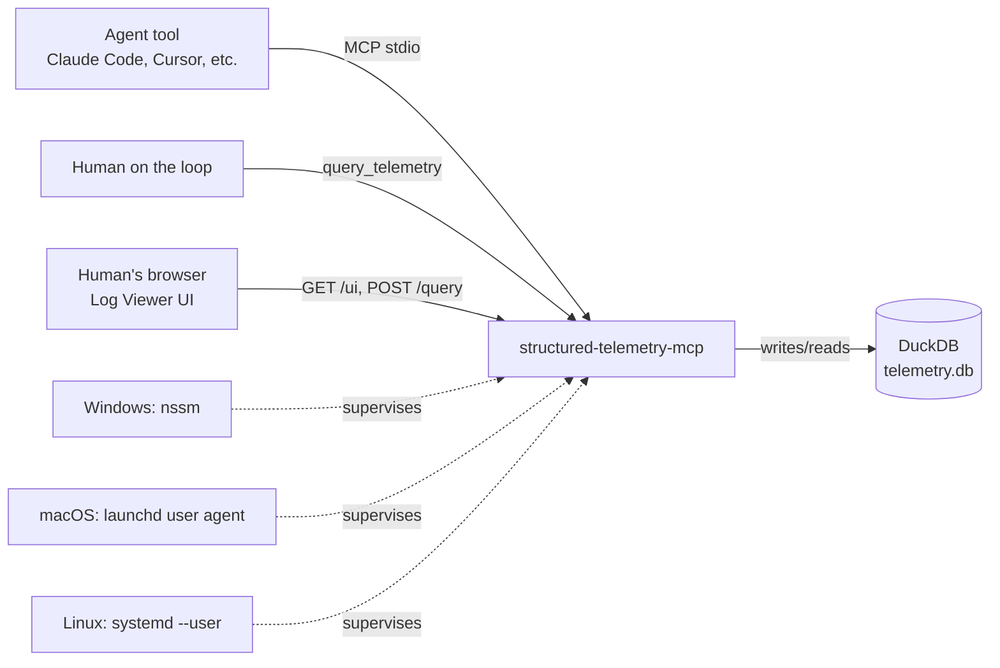
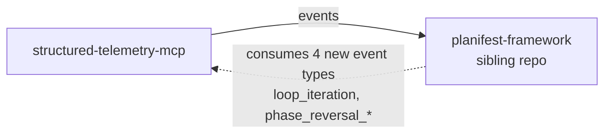

# Dependency Graph

> Living document. Shows how components relate. Updated after every pipeline run.
> Do not archive this file — update it in place.

Last updated: 0000016-e2e-playwright-test-suites

---

## Component Dependencies

Single-component repository — no inter-component dependencies exist within this repo.

---

## External System Dependencies

`planifest-framework` (a sibling repo, not part of this codebase) is a downstream consumer of the `emit_event` tool contract — added in `0000010-macos-launchd-service` for its `planifest-loop-runner` and phase-reversal-protocol skills. No code dependency in either direction; the relationship is entirely through the MCP tool call contract and the shared `schemas/telemetry-event.schema.json` file.

---

*Template: dependency-graph (see architecture-overview.template.md for related living-doc conventions)*
