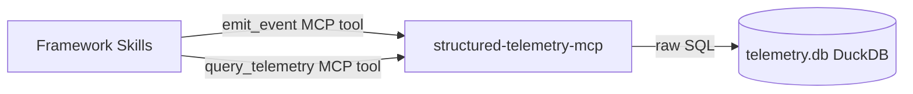

# Execution Plan - 0000008c-mcp-fixes-and-enhancements

**Skill:** spec-agent
**Tool:** Claude Code
**Model:** claude-sonnet-4-6
**Feature:** 0000008c-mcp-fixes-and-enhancements
**Phase:** 1 (single phase)
**Version:** 0.1.0
**Status:** active

---

## Functional Requirements Directory

Functional requirements are split into granular files to optimise agent context windows.

See `plan/current/requirements/` for individual feature requirements.

| File | Scope Items | Priority |
|------|-------------|----------|
| `req-001-schema-additions.md` | SCH-001–005 | must-have |
| `req-002-bug-mcp-mode-groupby.md` | BUG-001 | must-have |
| `req-003-bug-session-id-validation.md` | BUG-002, BUG-003 | must-have |
| `req-004-event-log-query.md` | FEA-001 | should-have |
| `req-005-initiative-id-groupby.md` | FEA-002 | should-have |
| `req-006-initiative-id-filter.md` | FEA-003 | should-have |
| `req-007-post-deployment-truncation.md` | POST-001 | must-have |

---

## Non-Functional Requirements

| ID | Category | Requirement | Target | Measurement |
|----|----------|------------|--------|-------------|
| NFR-001 | Performance | `emit_event` end-to-end latency under load | p95 < 100ms | `tests/performance.test.ts` — 1000 sequential iterations; `P95_THRESHOLD_MS = 100`; Windows GH-hosted runners measure ~28ms p95 in practice |
| NFR-002 | Reliability | `failure_sequence` and `drill_down` must not silently return empty results on missing `session_id` | Error thrown on missing `session_id` | Unit test: assert thrown error, not empty array |
| NFR-003 | Correctness | All 5 new event types must pass AJV schema validation for valid payloads and reject invalid ones | 100% of validation test cases pass | `tests/unit/validation.test.ts` |
| NFR-004 | Correctness | `event_log` results ordered by `timestamp` ascending | ORDER BY timestamp ASC enforced in SQL | Integration test: insert out-of-order events, assert sorted output |
| NFR-005 | Safety | `DELETE-ALL-PRODUCTION-RECORDS` scripts must not run without admin/sudo and interactive phrase confirmation | Script exits non-zero without elevation; aborts on wrong phrase | Manual post-deployment verification checklist |
| NFR-006 | Compatibility | All existing event types, query modes, and group_by values continue to function correctly after patch | Existing test suite passes without modification | CI matrix: ubuntu/macos/windows × node20/22 |
| NFR-007 | Dependency hygiene | All npm dependencies at latest stable version at ship time | No outdated packages | Verified via `npm outdated` against live registry before release build |

---

## API Summary

This component exposes two MCP tools (not REST endpoints). No OpenAPI specification is generated — the MCP tool contract is defined in `src/server-factory.ts` and `src/query/query-service.ts`.

| Tool | Input | Change in 0008c |
|------|-------|-----------------|
| `emit_event` | `TelemetryEvent` envelope | Accepts 5 new event types: `phase_skip`, `security_finding`, `retry_limit_exceeded`, `adr_decision`, `doc_gap` |
| `query_telemetry` | Query object (mode or group_by routed by dispatch) | New `group_by: "mcp_mode"` and `group_by: "initiative_id"`; new `initiative_id` filter on all families; new `mode: "event_log"` |

---

## Data Model Summary

No structural schema changes. All additions are to the `event` enum and `$defs` in `schemas/telemetry-event.schema.json`. The `events` table DDL is unchanged.

| Entity | Owner Component | Change in 0008c |
|--------|----------------|-----------------|
| `events` table | `structured-telemetry-mcp` | No DDL change; `event` column accepts 5 new values post-schema update |
| `telemetry-event.schema.json` | `structured-telemetry-mcp` | 5 new `$defs` entries; 5 new enum values; 5 new `oneOf` refs |

**Known documentation gap (flagged):** `model_config` column exists in `src/db/schema.ts` and the applied migration `docs/migrations/applied-add-model-config.md`, but is absent from the `events` table in `src/structured-telemetry-mcp/docs/data-contract.md`. The data contract update in this release must add it.

---

## Component Interactions

No new interaction points introduced in 0008c. Existing HTTP/SSE transport unchanged.

---

## Assumptions

| ID | Assumption | Impact if Wrong |
|----|-----------|----------------|
| A-001 | `initiative_id` and `mcp_mode` are first-class columns in the live `events` table | FEA-002, FEA-003, BUG-001 require a DB migration before they can be implemented |
| A-002 | `express` is present in `package.json` dependencies (installed during 0008a HTTP/SSE migration) | Build fails; must be added before bundling |
| A-003 | `event_log` requires at least one scope parameter (`session_id` or `initiative_id`); unbounded queries are not supported | If wrong, `event_log` must add pagination or a hard row cap |
| A-004 | No production users exist at time of truncation script execution | Data loss if assumption is wrong; mitigated by admin/sudo gate and interactive phrase |

---

## Open Questions

| ID | Question | Blocking |
|----|----------|----------|
| Q-001 | Should `event_log` with both `session_id` and `initiative_id` provided use AND logic (intersection) or OR logic (union)? | FEA-001 implementation in `req-004` |

*Recommended default:* AND (intersection) — more restrictive, avoids unexpectedly large result sets.

---

*Generated by spec-agent from confirmed design `plan/current/design.md` dated 2026-04-14.*
