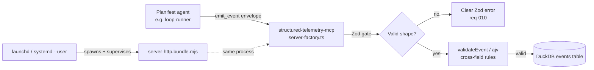

# Execution Plan - 0000010-macos-launchd-service

> Written by the spec-agent. Derived from the Feature Brief and RCA spec — not invented. Every requirement is traceable to a user story or acceptance criterion.

**Skill:** [spec-agent](../../planifest-framework/skills/planifest-spec-agent/SKILL.md)
**Tool:** Claude Code
**Model:** claude-sonnet-5
**Feature:** 0000010-macos-launchd-service
**Version:** 0.10.0
**Status:** active

---

## Active Skills

No capability skills loaded for this run — Bash/plist/systemd scripting and TypeScript/Zod schema work are both covered by the standard codegen-agent; no relevant capability skill identified at Skill Discovery (see `plan/current/design.md` › Active Skills).

---

## Functional Requirements Directory

| File | Requirement |
|------|------------|
| [req-001-macos-service-install.md](requirements/req-001-macos-service-install.md) | macOS launchd service install script |
| [req-002-macos-service-lifecycle.md](requirements/req-002-macos-service-lifecycle.md) | macOS uninstall/status/restart |
| [req-003-macos-locked-launchagents.md](requirements/req-003-macos-locked-launchagents.md) | Locked `~/Library/LaunchAgents` detection + sudo fallback |
| [req-004-macos-docs.md](requirements/req-004-macos-docs.md) | macOS setup docs |
| [req-005-linux-service-install.md](requirements/req-005-linux-service-install.md) | Linux systemd --user service install script |
| [req-006-linux-service-lifecycle.md](requirements/req-006-linux-service-lifecycle.md) | Linux uninstall/status/restart |
| [req-007-linux-lingering.md](requirements/req-007-linux-lingering.md) | Lingering detection + guidance |
| [req-008-linux-docs.md](requirements/req-008-linux-docs.md) | Linux setup docs |
| [req-009-emit-event-tool-schema.md](requirements/req-009-emit-event-tool-schema.md) | `emit_event` object-shaped Zod tool schema |
| [req-010-emit-event-error-clarity.md](requirements/req-010-emit-event-error-clarity.md) | Clear rejection errors for malformed calls |
| [req-011-four-new-event-types.md](requirements/req-011-four-new-event-types.md) | 4 new event types (loop_iteration, phase_reversal_*) |
| [req-012-emit-event-arg-rename.md](requirements/req-012-emit-event-arg-rename.md) | Tool argument rename `event` → `envelope` |

---

## Non-Functional Requirements

| ID | Category | Requirement | Target | Measurement |
|----|----------|------------|--------|-------------|
| NFR-001 | Reliability | Backend auto-restarts on crash, does not restart-loop on a clean/intentional stop | macOS: `KeepAlive.SuccessfulExit: false`. Linux: `Restart=on-failure` (not `always`) | Manual: kill process, confirm restart; manual `stop`, confirm no restart |
| NFR-002 | Idempotency | Running the install script twice does not create duplicate services or error | Re-install completes cleanly with no duplicate `launchctl`/`systemctl` registration | Manual: run install twice, inspect `launchctl list` / `systemctl --user list-units` |
| NFR-003 | Survivability (Linux) | Backend stays up after the developer's SSH session or GUI logout ends | `loginctl show-user $USER --property=Linger` is `yes`, or the install script has clearly warned that it isn't | Manual: log out, confirm `/health` still responds (with lingering enabled) |
| NFR-004 | Performance | `emit_event` p95 latency unaffected by the new Zod validation layer | p95 < 5ms (unchanged from existing target) | `tests/performance.test.ts` — existing performance gate |
| NFR-005 | Correctness | All 25 event types (21 existing + 4 new) validate consistently across all three enforcement layers | Zero drift between Zod enum, ajv schema `$defs`/enum, and `EVENT_REQUIRED_DATA_FIELDS` | `tests/integration/emit-event.test.ts` — full 25-type round-trip matrix |
| NFR-006 | Regression | No existing functionality breaks | Full existing suite passes; new total test count ≥ prior baseline (289 as of April 2026) | CI: `tests/unit`, `tests/integration`, `tests/regression`, `tests/performance.test.ts` |

> Latency/availability/scalability beyond the above are unchanged from 0000008's established targets (local process, no SLO) — see `plan/current/design.md` › Architecture Layer.

---

## API Summary

Not applicable — this feature does not add or modify any HTTP/REST endpoint. The `emit_event` and `query_telemetry` MCP tools already exist; this feature changes `emit_event`'s **argument schema and name** (Zod-level, tool-call contract) and adds new accepted `event` enum values, not a new API surface.

---

## Data Model Summary

| Entity | Owner Component | Key Fields | Relationships |
|--------|----------------|------------|--------------|
| `events` (existing table, unchanged structure) | structured-telemetry-mcp | `id`, `event` (now 25 possible values), `session_id`, `phase`, `timestamp`, `data` (JSON, 4 new possible shapes via `anyOf`) | No new relationships — additive `data` shapes only, no new tables, no migration file |

No new entities. No schema migration required — additive-only per the existing Schema Migration Policy (see req-011).

---

## Component Interactions

---

## Assumptions

| ID | Assumption | Impact if Wrong |
|----|-----------|----------------|
| A-001 | The backend continues to read `PLANIFEST_MCP_PORT` / `PLANIFEST_TELEMETRY_DB` from env with existing defaults | Plist/unit files need an env-override block added |
| A-002 | No known caller currently sends `emit_event`'s argument as anything other than a plain object | The new Zod gate starts rejecting a previously-"working" (by accident) caller |
| A-003 | Phase 2 (Linux) targets systemd-based distros only | A non-systemd target needs a different approach entirely — explicitly out of scope this pass |

(Full detail and status tracking: `plan/current/risk-register.md` › Assumptions Logged as Risks.)

---

## Open Questions

None material — the feature-brief.md, RCA spec, and reference docs left no unresolved question that blocks P2. Two non-blocking items are recorded as explicitly deferred (see `plan/current/scope.md` › Deferred) rather than left open: auto-fixing locked `LaunchAgents`, and auto-enabling lingering.

---

*Generated by spec-agent. See [Orchestrator Skill](../../planifest-framework/skills/planifest-orchestrator/SKILL.md)*
