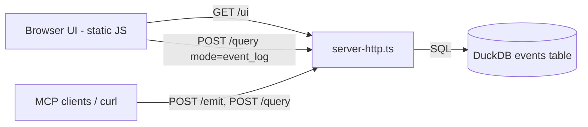

# Execution Plan - telemetry-log-viewer-ui

> Every requirement must be traceable to a user story or acceptance criterion.

**Skill:** [spec-agent](../skills/planifest-spec-agent/SKILL.md)
**Feature:** 0000015-telemetry-log-viewer-ui
**Wave:** 1 (single wave)
**Version:** 0.11.0
**Status:** active

## Active Skills

None — no capability skills installed for this run (plain vanilla JS/HTML frontend needs no framework-specific skill).

## Functional Requirements Directory

| File | Requirement |
|------|------------|
| [req-001-product-id-tagging.md](requirements/req-001-product-id-tagging.md) | Add optional `product_id` field to schema + DB column + migration proposal; no backfill |
| [req-002-event-log-table.md](requirements/req-002-event-log-table.md) | Remove mandatory scope-filter requirement; add offset/sort/total_count; expand SELECT to full row; serve static UI table |
| [req-003-event-filtering.md](requirements/req-003-event-filtering.md) | Add phase/agent/product_id/from/to filters; URL-state persistence; zero-result state |
| [req-004-event-detail-view.md](requirements/req-004-event-detail-view.md) | Row click → full pretty-printed JSON, no new request |

## Non-Functional Requirements

| ID | Category | Requirement | Target | Measurement |
|----|----------|------------|--------|-------------|
| NFR-001 | Performance | `event_log` query + UI page render | p95 < 300ms per page load/query | Manual timing at P4 against local DuckDB with representative data volume |
| NFR-002 | Security | No new network exposure | Server remains bound to 127.0.0.1 only, no auth added | Code review at P5 confirms no new listen address/port |
| NFR-003 | Data privacy | UI makes zero external network calls | 0 non-127.0.0.1 fetch/XHR calls in UI code | Code review at P5 — grep UI JS for fetch/XHR targets |
| NFR-004 | Compatibility | Existing `event_log` callers (MCP tool, REST) unaffected by the scope-filter removal and new optional params | All pre-existing passing tests for `event_log` with a scope filter still pass unmodified; only the "no scope filter throws" tests change | P4 full test suite run |

> "The system should be fast" is not a requirement. "p95 latency < 200ms for the primary endpoint" is.

## API Summary

No OpenAPI specification is produced for this feature — the project has never documented its internal `POST /query` / `POST /emit` REST surface via OpenAPI (component manifest records `apiSpec: "none"`; no prior feature 0000008–0000014 produced one). The contract is documented in `docs/usage-guide.md` and `src/structured-telemetry-mcp/docs/interface-contract.md`, updated at P6 per existing project convention.

| Method | Path | Description | Feature |
|--------|------|-------------|---------|
| POST | /query | Extended: `event_log` mode gains `offset`, `sort`, `phase`, `agent`, `product_id`, `from`, `to`; scope-filter requirement removed | 0000015-telemetry-log-viewer-ui |
| POST | /emit | Extended: envelope accepts optional `product_id` | 0000015-telemetry-log-viewer-ui |
| GET | /ui | New: serves the static browser log-viewer page | 0000015-telemetry-log-viewer-ui |

## Data Model Summary

The full schema is in `src/structured-telemetry-mcp/docs/data-contract.md`.

| Entity | Owner Component | Key Fields | Relationships |
|--------|----------------|------------|--------------|
| `events` | structured-telemetry-mcp | id (PK), event, session_id, initiative_id, phase, agent, tool, model, mcp_mode, timestamp, model_config, data, inserted_at, **product_id (new, nullable)** | None (single flat table) |

## Component Interactions

## Assumptions

Each is a risk item with likelihood: medium.

| ID | Assumption | Impact if Wrong |
|----|-----------|----------------|
| A-001 | The existing `server-http.ts` process is the right place to serve the UI's static assets | UI would need its own process/port, adding deployment complexity |
| A-002 | Local event volumes are small enough for offset pagination to perform acceptably | Revisit pagination strategy (e.g. cursor-based) if the p95 latency NFR is missed at realistic data volumes |
| A-003 | No existing MCP/REST caller depends on the old "event_log requires a scope filter" error as intentional, relied-upon behavior (only test assertions found reference it, not application logic) | A caller's error-handling path becomes silently unreachable — harmless, but worth a final grep sweep at P4 |

## Open Questions

None — all material gaps were resolved during P0 coaching (see `plan/current/build-log.md` P0 exchanges).
