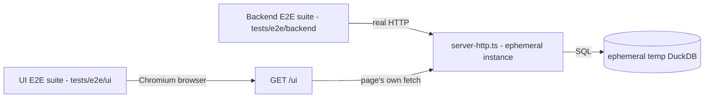

# Execution Plan - E2E Playwright Test Suites

> Every requirement must be traceable to a user story or acceptance criterion.

**Skill:** [spec-agent](../skills/planifest-spec-agent/SKILL.md)
**Feature:** 0000016-e2e-playwright-test-suites
**Wave:** 1 (single wave)
**Version:** 0.12.0
**Status:** active

## Active Skills

| Skill | Scope | Purpose |
|-------|-------|---------|
| playwright | permanent | Playwright browser verification workflow for user-journey evidence with deterministic replay artifacts — used during P3 codegen |

## Functional Requirements Directory

| File | Requirement |
|------|------------|
| [req-001-backend-e2e-suite.md](requirements/req-001-backend-e2e-suite.md) | Black-box HTTP-level E2E coverage for `/emit`, `/query`, `/health` against a real server + ephemeral DuckDB |
| [req-002-ui-e2e-suite.md](requirements/req-002-ui-e2e-suite.md) | Browser-driven (Chromium) E2E coverage for `GET /ui` — filters, pagination, zero-result state, detail view |

## Non-Functional Requirements

| ID | Category | Requirement | Target | Measurement |
|----|----------|------------|--------|-------------|
| NFR-001 | Performance | Combined CI runtime for both E2E suites | p95 < 5 min | GitHub Actions job duration, measured at P4 |
| NFR-002 | Reliability | Flakiness tolerance | 1 retry in CI, 0 retries locally | `@playwright/test` `retries` config, verified at P4 |
| NFR-003 | Isolation | No shared state between test runs | Each run uses a fresh ephemeral DuckDB temp file + ephemeral port | Verified at P4 by running both suites in parallel without collision |
| NFR-004 | Security | No new network exposure introduced by the test harness | Server under test remains bound to 127.0.0.1 only, no auth added | Code review at P5 confirms no new listen address/port in the harness |
| NFR-005 | Compatibility | Existing Vitest unit/integration suite unaffected | All existing `npm test` (Vitest) tests continue to pass unmodified | P4 full test suite run |

> "The system should be fast" is not a requirement. "p95 latency < 200ms for the primary endpoint" is.

## API Summary

No OpenAPI specification is produced for this feature — it tests the existing `/emit`, `/query`, `/health`, `/ui` surface without building or modifying an API (per spec-agent's critical condition; the project has never documented this internal surface via OpenAPI regardless — see `docs/usage-guide.md` and `src/structured-telemetry-mcp/docs/interface-contract.md` for the existing contract, unchanged by this feature).

| Method | Path | Description | Feature |
|--------|------|-------------|---------|
| POST | /emit | Exercised, not modified | 0000016-e2e-playwright-test-suites |
| POST | /query | Exercised, not modified | 0000016-e2e-playwright-test-suites |
| GET | /health | Exercised, not modified | 0000016-e2e-playwright-test-suites |
| GET | /ui | Exercised, not modified | 0000016-e2e-playwright-test-suites |

## Data Model Summary

No new data model. Full schema is in `src/structured-telemetry-mcp/docs/data-contract.md` (unchanged).

| Entity | Owner Component | Key Fields | Relationships |
|--------|----------------|------------|--------------|
| `events` (test fixture rows only, ephemeral per-run DuckDB) | structured-telemetry-mcp (test harness) | Same shape as production `events` table | None — isolated ephemeral store, never the dev/prod DB |

## Component Interactions

## Assumptions

Each is a risk item with likelihood: medium.

| ID | Assumption | Impact if Wrong |
|----|-----------|----------------|
| A-001 | Chromium-only coverage is sufficient given the deliberately minimal vanilla-JS UI (ADR-018, no framework-specific or browser-specific behavior expected) | Cross-browser bugs ship undetected; add Firefox/WebKit projects to `playwright.config.ts` later if this occurs |
| A-002 | `npx playwright install chromium --with-deps` fits within the 5-minute CI budget as a one-time build step | NFR-001 needs revisiting, or the browser install needs to be cached between CI runs |
| A-003 | Starting a real child-process server per test file (rather than one shared server for the whole suite) keeps runs isolated without breaching the runtime budget | Revisit to a single shared server + per-test DB reset if per-file startup overhead threatens NFR-001 |

## Open Questions

None — all material gaps were resolved during P0 coaching (see `plan/current/build-log.md` P0 exchanges).
