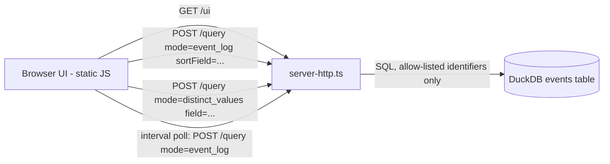

# Execution Plan - log-viewer-enhancements

> Every requirement must be traceable to a user story or acceptance criterion.

**Skill:** [spec-agent](../skills/planifest-spec-agent/SKILL.md)
**Feature:** 0000017-log-viewer-enhancements
**Wave:** 1 of 2 (Wave 2 — aggregation/dashboard views — deferred to backlog #00004)
**Version:** 0.13.0
**Status:** active

## Active Skills

None — no capability skills installed for this run (plain vanilla JS/HTML frontend needs no framework-specific skill, unchanged from 0000015).

## Functional Requirements Directory

| File | Requirement |
|------|------------|
| [req-001-auto-refresh-tail-mode.md](requirements/req-001-auto-refresh-tail-mode.md) | Toggleable interval polling of `/query`, URL-persisted, never blanks table/loses scroll, degrades gracefully on poll failure |
| [req-002-filter-combobox-suggestions.md](requirements/req-002-filter-combobox-suggestions.md) | New `distinct_values` query mode + allow-listed column lookup; `<datalist>`-based suggestions on the 6 filterable fields |
| [req-003-sortable-headers-three-way-sync.md](requirements/req-003-sortable-headers-three-way-sync.md) | New backend allow-listed `sortField` param (was hardcoded to `timestamp`); clickable headers, dropdown, and URL stay three-way synced |

## Non-Functional Requirements

| ID | Category | Requirement | Target | Measurement |
|----|----------|------------|--------|-------------|
| NFR-001 | Performance | `event_log` query (incl. new `sortField`) + new `distinct_values` query | p95 < 300ms per poll/query (inherited from 0000015) | Manual timing at P4 against local DuckDB with representative data volume |
| NFR-002 | Security | No new network exposure | Server remains bound to 127.0.0.1 only, no auth added | Code review at P5 confirms no new listen address/port |
| NFR-003 | Security | Allow-listed SQL identifiers only | Neither `sortField` (req-003) nor `field` (req-002) is ever string-interpolated into SQL without a prior allow-list membership check | Code review at P5; regression tests assert rejection of non-allow-listed/injection-shaped input on both endpoints |
| NFR-004 | Compatibility | Existing `event_log` callers (MCP tool, REST) unaffected by the new optional `sortField` param | All pre-existing passing tests for `event_log` continue to pass unmodified; default sort remains `timestamp` when `sortField` is omitted | P4 full test suite run |
| NFR-005 | Data privacy | UI makes zero external network calls | 0 non-127.0.0.1 fetch/XHR calls in UI code (auto-refresh polling and suggestion fetches both target the existing local `/query` endpoint only) | Code review at P5 — grep UI JS for fetch/XHR targets |

> "The system should be fast" is not a requirement. "p95 latency < 200ms for the primary endpoint" is.

## API Summary

No OpenAPI specification is produced for this feature — consistent with every prior feature (0000008–0000016), the project has never documented its internal `POST /query` / `POST /emit` REST surface via OpenAPI (component manifest records `apiSpec: "none"`). The contract is documented in `docs/usage-guide.md` and `src/structured-telemetry-mcp/docs/interface-contract.md`, updated at P6 per existing project convention.

| Method | Path | Description | Feature |
|--------|------|-------------|---------|
| POST | /query | Extended: `event_log` mode gains `sortField` (allow-listed: `timestamp`, `event`, `session_id`, `phase`, `agent`, `product_id`; defaults to `timestamp`, non-breaking) | 0000017-log-viewer-enhancements |
| POST | /query | New: `mode: 'distinct_values'` — returns up to 20 distinct values for an allow-listed filterable field, optional prefix-match `q` param | 0000017-log-viewer-enhancements |
| GET | /ui | Unchanged route, extended page: auto-refresh toggle, filter comboboxes, clickable sortable headers | 0000017-log-viewer-enhancements |

## Data Model Summary

No schema/DB changes in this feature — both new capabilities (sort field, distinct-values suggestions) read existing `events` columns only. Full schema is in `src/structured-telemetry-mcp/docs/data-contract.md`.

| Entity | Owner Component | Key Fields (read, unchanged) | Relationships |
|--------|----------------|------------|--------------|
| `events` | structured-telemetry-mcp | id, event, session_id, initiative_id, phase, agent, product_id, timestamp (all now selectable as a sort field or distinct-values field, subject to the allow-list) | None (single flat table) |

## Component Interactions

## Assumptions

Each is a risk item with likelihood: medium (also recorded in `risk-register.md`).

| ID | Assumption | Impact if Wrong |
|----|-----------|----------------|
| A-001 | Polling (not WebSocket/SSE push) is sufficient for "live" auto-refresh at local single-developer data volumes | Revisit a push-based approach if poll latency/load becomes noticeable |
| A-002 | Distinct filter-value suggestions can be served from the existing `events` table with a lightweight `SELECT DISTINCT` query, without a new index | May need an index or a cached/precomputed values list if suggestion queries are slow at scale |

## Open Questions

None — the one material gap found during P1 (the assumed pre-existing "sort-field dropdown" that turned out not to exist) was resolved with the human before requirements were drafted; see `plan/current/build-log.md` P1 "spec_gap (sort field)" exchange.
