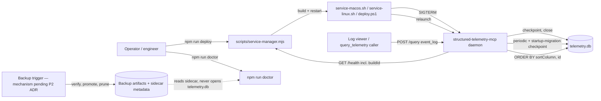

# Execution Plan - Telemetry Data Integrity

> Every requirement must be traceable to a user story or acceptance criterion.

**Skill:** [spec-agent](../skills/planifest-spec-agent/SKILL.md)
**Feature:** 0000018-telemetry-data-integrity
**Wave:** 1 of 1 (no wave split needed)
**Version:** 0.14.0
**Status:** active

## Active Skills

None. `planifest-framework/skills-inbox/` is empty and no capability skills are installed for this run — reconfirmed at P1, unchanged from the P0 assessment in design.md (a Node daemon durability/backup feature has no UI or document-generation surface for the available capability skills to add value to).

## Functional Requirements Directory

Functional requirements are split into individual files — one testable unit per file — at `plan/current/requirements/`.

| File | Requirement | User Story |
|------|------------|------------|
| [req-001-graceful-shutdown-checkpoint.md](requirements/req-001-graceful-shutdown-checkpoint.md) | `SIGTERM`/`SIGINT` handler checkpoints DuckDB and closes cleanly before exit | US-002 |
| [req-002-periodic-checkpoint.md](requirements/req-002-periodic-checkpoint.md) | Checkpoint every 60s or 100 events, whichever first, bounding the data-at-risk window | US-002 |
| [req-003-wal-safe-migrations.md](requirements/req-003-wal-safe-migrations.md) | Checkpoint immediately after any startup `ALTER TABLE ADD COLUMN` migration | US-002 |
| [req-004-refuse-to-start-unopenable-database.md](requirements/req-004-refuse-to-start-unopenable-database.md) | Refuse to start on a locked/poisoned-WAL database; never touch the WAL; name the file, PID, and recovery path | US-002 |
| [req-005-supervision-config-and-exit-posture.md](requirements/req-005-supervision-config-and-exit-posture.md) | launchd/systemd throttle + circuit-breaker config so refuse-to-start does not become a restart loop | US-002 |
| [req-006-scheduled-verified-backup.md](requirements/req-006-scheduled-verified-backup.md) | Daily backup, verify → promote → prune, 7 daily + 4 weekly retention | US-003 |
| [req-007-doctor-backup-staleness.md](requirements/req-007-doctor-backup-staleness.md) | `doctor` reports verified-backup age (or "no verified backup") from a sidecar file, never by opening the live DB | US-003 |
| [req-008-deploy-build-identity-assertion.md](requirements/req-008-deploy-build-identity-assertion.md) | Deploy compares a build-content fingerprint, not just `version`, across all three platforms | US-001 |
| [req-009-deploy-orphan-port-detection.md](requirements/req-009-deploy-orphan-port-detection.md) | Deploy detects a port held by an unmanaged process and refuses to report success | US-001 |
| [req-010-pagination-tiebreaker.md](requirements/req-010-pagination-tiebreaker.md) | `id` tiebreaker on every event-log `ORDER BY`, with a duplicate-sort-key regression test | US-004 |

## Non-Functional Requirements

| ID | Category | Requirement | Target | Measurement |
|----|----------|------------|--------|-------------|
| NFR-001 | Durability | Data-at-risk window on an unclean kill | Checkpoint every 60s or 100 events, whichever first, plus on graceful shutdown; max loss ≤ that window | `kill -9` under sustained write; count events present after reopen; assert loss ≤ window (req-001, req-002) |
| NFR-002 | Durability / Recoverability | Backup frequency and retention | Daily; retained 7 daily + 4 weekly | Scheduler config + retention-prune test asserting the policy count holds (req-006) |
| NFR-003 | Recoverability | Restore verification | On every backup, immediately: restore to scratch, open, assert row count pinned at export time, discard | Automated as part of the backup routine; a failed verification is surfaced, never swallowed (req-006, req-007) |
| NFR-004 | Correctness | Pagination completeness | 0 dropped and 0 duplicated rows across a full pagination, every sortable field, both directions | Seed rows with duplicate sort keys; page through; assert union equals source set exactly (req-010) |
| NFR-005 | Correctness | Deploy detection accuracy | 100% detection of a running daemon whose build artifact differs from the one just built, including same-version redeploys | Deploy against a deliberately stale daemon at the same version; assert non-zero exit and a message naming both identities (req-008, req-009) |
| NFR-006 | Availability | No restart loop under a genuinely unusable store | Daemon stays stopped; supervision does not respawn it into the same failure indefinitely | Simulate a poisoned-WAL/locked-store condition under supervision; assert respawn attempts are bounded, not infinite (req-004, req-005) |

> Latency, scalability, and cost are explicitly not constrained for this feature (design.md Architecture Layer) — single-user localhost deployment, ~4,100 events over 7 weeks observed. No NFR entries for these axes; not an omission.

## API Summary

No OpenAPI specification is generated for this feature. `GET /health` gains one additive field (`buildId`, req-008) — no new route, no breaking change to the existing `{ ok, version }` shape. Consistent with existing project precedent (`docs/api-index.md`): this component's small, stable REST surface (`/emit`, `/query`, `/health`, `/ui`) has never had a formal OpenAPI spec — `docs/usage-guide.md` §3–4 and `docs/api-index.md` serve as the contract. Not flagged as a gap by prior features' P1 passes; not revisited here since this feature adds no new endpoint.

| Method | Path | Description | Feature |
|--------|------|-------------|---------|
| GET | `/health` | Gains additive `buildId` field (SHA-256 of `server-http.bundle.mjs`) alongside existing `ok`/`version` | req-008 |

## Data Model Summary

The full schema is in `src/structured-telemetry-mcp/docs/data-contract.md`.

| Entity | Owner Component | Key Fields | Relationships |
|--------|----------------|------------|--------------|
| `events` (existing table) | structured-telemetry-mcp | unchanged — no new columns this feature | none |
| Backup artifact (new, not a DB table) | structured-telemetry-mcp | timestamped `EXPORT DATABASE` directory + sidecar JSON metadata (timestamp, row count, verified flag) | verifies against `events` at export time (req-006) |

No schema migration is required for this feature — `req-003` changes *when* the two existing migrations checkpoint, not their SQL. See `data-contract.md`'s updated Backup Artifacts section and Migration Policy note.

## Component Interactions

## Assumptions

Each is a risk item with likelihood: medium — see `risk-register.md`'s "Assumptions Logged as Risks" table for the full detail (A-001 through A-004).

| ID | Assumption | Impact if Wrong |
|----|-----------|----------------|
| A-001 | Single-user, localhost deployment — no multi-writer/clustered scenario. | Breaks the no-auth and backup-ownership design; see risk-register.md R-001. |
| A-002 | `EXPORT DATABASE` survives DuckDB version changes, unlike the ALTER-based approach that caused the incident. | Backups could become unreadable by the same class of failure this feature exists to prevent (req-006). To confirm at P2. |
| A-003 | Existing developer machines may already hold a poisoned-WAL database — req-004 must treat this as routine, not exceptional. | Under-tested error path if treated as rare. |
| A-004 | `/health` has reported `version` since 0.12.0, so most daemons in the field can be build-identity-compared once upgraded; a daemon predating this feature reports no `buildId` at all. | req-008 must degrade to a warning (not a false pass) for the very first deploy after upgrading past this feature's version. |

## Open Questions

Reported to the orchestrator — not filled in by assumption. Both were already identified and routed to a P2 ADR during P0 coaching (design.md Risks; build-log.md P0 Gate section) — restated here for requirements traceability, not raised as new gaps.

| ID | Question | Blocking |
|----|----------|----------|
| Q-001 | Who triggers the scheduled backup — in-process (daemon's own timer) or an external scheduler — given DuckDB's single-writer lock is exactly what produced the 2026-08-03 crash loop? | req-006's triggering mechanism (the verify→promote→prune routine itself is independent and unblocked) |
| Q-002 | Does the daemon's refuse-to-start exit code follow ADR-005's exit-zero-for-hooks precedent, or exit non-zero and rely on supervision throttling (req-005)? | req-004's exit code, req-005's specific throttle/circuit-breaker thresholds |
